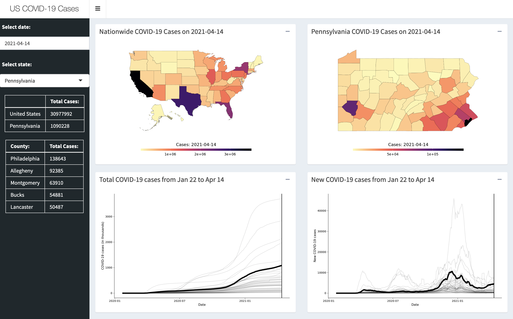
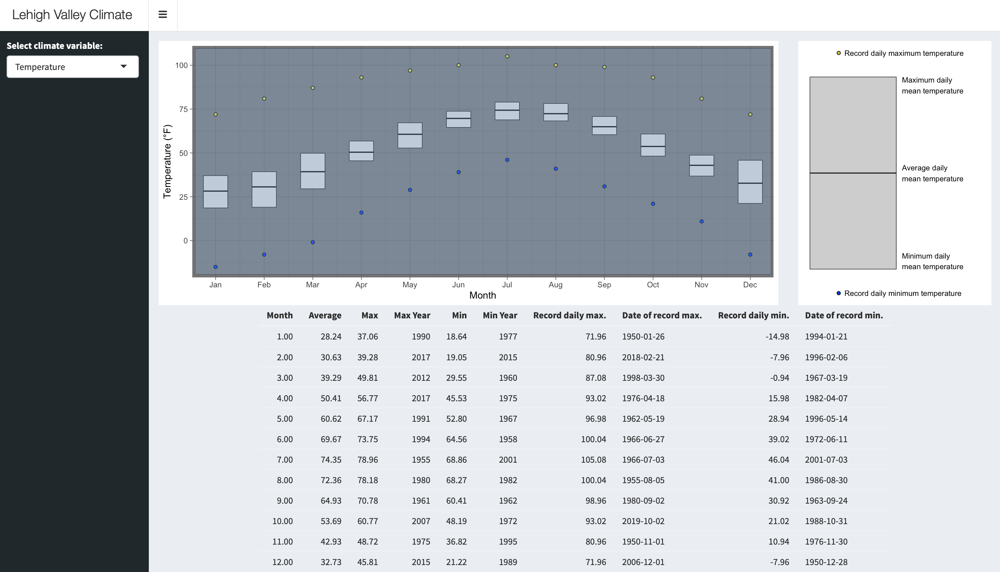
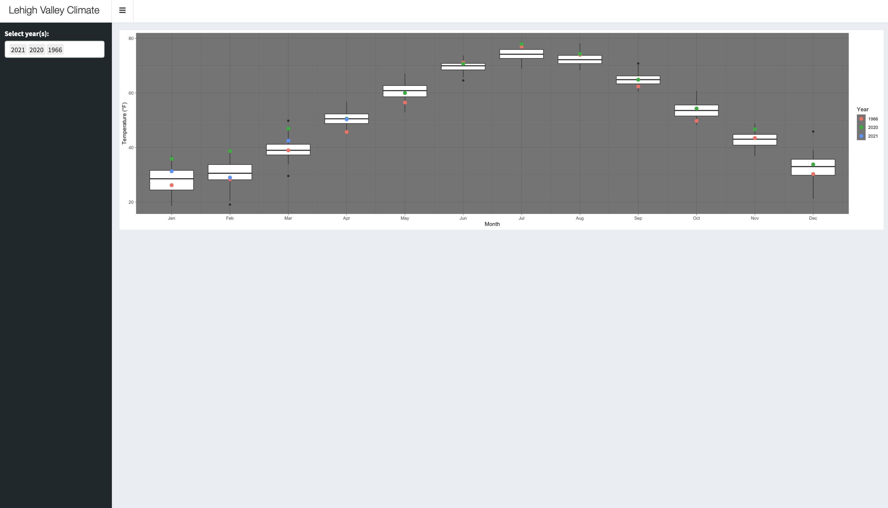

class: center, middle, inverse, title-slide
<style>
  pre {
    background-color: lightyellow;
    white-space: pre-wrap;
    line-height: 100%;
  }
</style>

```{r xaringan-panelset, echo = FALSE}
xaringanExtra::use_panelset()
```

```{r xaringan-tile-view, echo=FALSE}
xaringanExtra::use_tile_view()
```

```{r echo=FALSE}
xaringanExtra::style_panelset_tabs(
  active_foreground = "#0051BA",
  hover_foreground = "#d22",
  font_family = "Roboto"
)
```

## Shiny Apps with R
#### Jeremy Mack
#### Lehigh University - Digital Scholarship Team
 &nbsp;
 &nbsp;

<br/><br/>
<br/><br/>
<br/>
---
### About this presentation

 * This seminar is the third in a series on R programming, with
   a focus on creating [Shiny Apps](https://shiny.rstudio.com/) in R.
 
 * It is targeted at people that have experience programming in R.
 
 * Focuses on a modern style of programming in R that uses a series of packages known as the [Tidyverse](https://www.tidyverse.org/).
   
 * Slides are available on [Lehigh's Research Computing site](https://confluence.cc.lehigh.edu/display/hpc/Seminars), [Wordpress](https://wordpress.lehigh.edu/jsm4/r-at-lehigh/data-visualization-with-r/), and Github ([slides](https://jeremymack-lu.github.io/shinyapps/) and [raw code](https://github.com/jeremymack-LU/shinyapps))

---
### Structure of the presentation

The presentation is split into five topics:

 * [**Topic 1:**](https://jeremymack-lu.github.io/shinyapps/#4) Shiny Apps - an overview
 
 * [**Topic 2:**](https://jeremymack-lu.github.io/shinyapps/#14) User Interface (ui)
 
 * [**Topic 3:**](https://jeremymack-lu.github.io/shinyapps/#20) Reactive Programming (server)
 
 * [**Topic 4:**](https://jeremymack-lu.github.io/shinyapps/#28) Layouts and Themes
 
 * [**Topic 5:**](https://jeremymack-lu.github.io/shinyapps/#39) Example
 
 * [**Topic 6:**](https://jeremymack-lu.github.io/shinyapps/#59) Resources

---
class: center, middle, inverse

#### Topic 1: Shiny Apps - an overview
<br/><br/>
<br/><br/>
<br/><br/>
<br/><br/>
<br/><br/>

---
#### Topic 1: Shiny Apps - an overview
.right-column2[
<center>
]

.left-column2[
* [RStudio](<https://shiny.rstudio.com/>) product - **shiny**

* Web application framework for R

* Used to create interactive applications, such as dashboards

 * Reactive Programming
]

---
#### Topic 1: Shiny Apps - an overview

[<center></center>](https://shiny.cc.lehigh.edu/jsm4/covid19)

---
#### Topic 1: Shiny Apps - an overview
.right-column2[
<center>
]

.left-column2[
* [RStudio](<https://shiny.rstudio.com/>) product - **shiny**

* Web application framework for R

* Three basic components:

 1. a user interface object (ui)
{{content}}
]

--

 2. a server function (server)
{{content}}

--

 3. a call to the **shinyApp** function
{{content}}

---
#### Topic 1: Shiny Apps - an overview
.right-column2[
<center>
]

.left-column2[
* [RStudio](<https://shiny.rstudio.com/>) product - **shiny**

* Web application framework for R

* Ways to start creating a Shiny App:

 1. In RStudio, click the new file button and select **Shiny Web App...**

]

---
#### Topic 1: Shiny Apps - an overview
.right-column2[
<center>
<center>
]

.left-column2[
* [RStudio](<https://shiny.rstudio.com/>) product - **shiny**

* Web application framework for R

* Ways to start creating a Shiny App:

 1. In RStudio, click the new file button and select **Shiny Web App...**

 2. In RStudio, click **File** | **New Project**, then select **New Directory** and **Shiny Web Application**

]

---
#### Topic 1: Shiny Apps - an overview
.right-column2[
<center>
]

.left-column2[
* [RStudio](<https://shiny.rstudio.com/>) product - **shiny**

* Web application framework for R

* Ways to start creating a Shiny App:

 1. In RStudio, click the new file button and select **Shiny Web App...**
 
 2. In RStudio, click **File** | **New Project**, then select **New Directory** and **Shiny Web Application**

 3. Create a new directory and put a single file called app.R in it

]

---
#### Topic 1: Shiny Apps - an overview
.right-column2[
<center>
<center>
]

.left-column2[
* [RStudio](<https://shiny.rstudio.com/>) product - **shiny**

* Web application framework for R

* Ways to start creating a Shiny App:

 1. In RStudio, click the new file button and select **Shiny Web App...**
 
 2. In RStudio, click **File** | **New Project**, then select **New Directory** and **Shiny Web Application**
 
 3. Create a new directory and put a single file called app.R in it
 
 * Shortcut: You can add the app boilerplate by typing **shinyapp** and pressing Shift+Tab

]

---
class: center, middle, inverse

#### Topic 2: User Interface (ui)
<br/><br/>
<br/><br/>
<br/><br/>
<br/><br/>
<br/><br/>

---
#### Topic 2: User Interface (ui)
.right-column2[
<center>
]

.left-column2[
* Application's front end appearance

* Collection of inputs and outputs
{{content}}
]

--

* Input functions
  - Adds input controls to the ui
  
  - First argument: **inputId**
  
  - Different types of controls:
     * Free text
     * Numeric 
     * Dates 
     * Limited choices
     * File uploads
     * Action buttons
---
#### Topic 2: User Interface (ui)
.panelset[

.panel[.panel-name[Text]

.tiny[
```{r, eval=FALSE}
# Free text
ui <- fluidPage(
  textInput("name", "What's your name?"),
  passwordInput("password", "What's your password?"),
  textAreaInput("story", "Tell me about yourself", rows = 3)
)

server <- function(input, output, session) {}

shinyApp(ui, server)
```
]]

.panel[.panel-name[Numeric]

.tiny[
```{r, eval=FALSE}
# Numeric inputs
ui <- fluidPage(
  numericInput("num", "Number one", value = 0, min = 0, max = 100),
  sliderInput("num2", "Number two", value = 50, min = 0, max = 100),
  sliderInput("rng", "Range", value = c(10, 20), min = 0, max = 100)
)

server <- function(input, output, session) {}

shinyApp(ui, server)
```
]]

.panel[.panel-name[Dates]

.tiny[
```{r, eval=FALSE}
# Dates
ui <- fluidPage(
  dateInput("dob", "When were you born?"),
  dateRangeInput("range", "What is the range of your data?")
)

server <- function(input, output, session) {}

shinyApp(ui, server)
```
]]

.panel[.panel-name[Choices]

.tiny[
```{r, eval=FALSE}
# Limited choices
# Drop downs (single or multiple choices)
ui <- fluidPage(
  selectInput("state", "What's your favorite state?", state.name),
  selectInput("state2", "What's your favourite state(s)?", state.name,
              multiple = TRUE)
)
# Radio buttons (single choice)
animals <- c("dog", "cat", "mouse", "bird", "other", "I don't like animals")

ui <- fluidPage(
  radioButtons("animal", "What's your favorite animal?", animals)
)
# Checkbox (multiple choices)
ui <- fluidPage(
  radioButtons("animal", "What's your favorite animal?", animals),
  checkboxGroupInput("animal", "What animals do you like?", animals)
)

```
]]

.panel[.panel-name[Uploads]

.tiny[
```{r, eval=FALSE}
# File uploads
ui <- fluidPage(
  fileInput("upload", NULL)
)

server <- function(input, output, session) {}

shinyApp(ui, server)
```
]]

.panel[.panel-name[Action buttons]

.tiny[
```{r, eval=FALSE}
# Action buttons
ui <- fluidPage(
  actionButton("click", "Click me!"),
  actionButton("download", "Download")
)

server <- function(input, output, session) {}

shinyApp(ui, server)
```
]]

]

---
#### Topic 2: User Interface (ui)
.right-column2[
<center>
]

.left-column2[
* Application's front end appearance

* Collection of inputs and outputs

* Output functions
  - Creates placeholders later filled by the server function (render)
  
  - First argument: **outputId**
  
  - Three main types:
     * Text
     * Tables
     * Plots
]

---
#### Topic 2: User Interface (ui)
.panelset[

.panel[.panel-name[Text]

.tiny[
```{r, eval=FALSE}
# Text output
ui <- fluidPage(
  textInput("name", "What's your name?"),
  textOutput("text"),
)

server <- function(input, output, session) {
  output$text <- renderText({ 
    input$name
  })
}

shinyApp(ui, server)
```
]]

.panel[.panel-name[Tables]

.tiny[
```{r, eval=FALSE}
# Table outputs
ui <- fluidPage(
  tableOutput("static"),
  dataTableOutput("dynamic")
)

server <- function(input, output, session) {
  output$static <- renderTable(head(mtcars))
  output$dynamic <- renderDataTable(mtcars, options = list(pageLength = 5))
}

shinyApp(ui, server)
```
]]

.panel[.panel-name[Plots]

.tiny[
```{r, eval=FALSE}
# Plot outputs
ui <- fluidPage(
  plotOutput("plot", width = "800px")
)

server <- function(input, output, session) {
  output$plot <- renderPlot(
    ggplot(mtcars) + geom_point(aes(mpg,hp))
  )
}

shinyApp(ui, server)
```
]]
]

---
class: center, middle, inverse

#### Topic 3: Reactive Programming (server)
<br/><br/>
<br/><br/>
<br/><br/>
<br/><br/>
<br/><br/>

---
#### Topic 3: Reactive Programming (server)
.right-column2[
<center>
]

.left-column2[
* Application's back end logic

* **Server** function
{{content}}
]

--

* Creates (renders) outputs based on inputs from the browser

---
#### Topic 3: Reactive Programming (server)
.right-column2[
<center>
<center>
<center>
<center>
]

.tiny2.left-column2[
* Application's back end logic

* **Server** function

* Creates (renders) outputs based on inputs from the browser

```{r, eval=FALSE}
ui <- fluidPage(
  textInput("name", "What's your name?"),
  textOutput("text")
)

server <- function(input, output, session) {
  output$text <- renderText(
    paste("Hello, my name is ", input$name))
}

shinyApp(ui, server)
```
]

---
#### Topic 3: Reactive Programming (server)
.right-column2[
<center>
<center>
]

.left-column2[
* Application's back end logic

* **Server** function

* Creates (renders) outputs based on inputs from the browser

* Some things to remember:
 * **input** objects are read-only
]

---
#### Topic 3: Reactive Programming (server)
.right-column2[
<center>
<center>
]

.left-column2[
* Application's back end logic

* **Server** function

* Creates (renders) outputs based on inputs from the browser

* Some things to remember:
 * **input** objects are read-only
 
 * **input** and **output** objects are read in reactive context created by a function like renderText() or reactive()
]

---
#### Topic 3: Reactive Programming (server)
.right-column2[
<center>
<center>
]

.left-column2[
* Application's back end logic

* **Server** function

* Creates (renders) outputs based on inputs from the browser

* Some things to remember:
 * **input** objects are read-only
 
 * **input** and **output** objects are read in reactive context created by a function like renderText() or reactive()
 
 * Check your spelling!
]

---
#### Topic 3: Reactive Programming (server)
.right-column2[
<center>
<center>
]

.left-column2[
* Application's back end logic

* **Server** function

* Creates (renders) outputs based on inputs from the browser

* Some things to remember:
 * **input** objects are read-only
 
 * **input** and **output** objects are read in reactive context created by a function like renderText() or reactive()
 
 * Check your spelling!
]

---
class: center, middle, inverse

#### Topic 4: Layouts and Themes
<br/><br/>
<br/><br/>
<br/><br/>
<br/><br/>
<br/><br/>

---
#### Topic 4: Layouts and Themes
.right-column2[
<center>
]

.left-column2[
* Layouts add structure to an application

* Created by a hierarchy of function calls
]

---
#### Topic 4: Layouts and Themes
.right-column2[
<center>
]

.tiny2.left-column2[
* Layouts add structure to an application

* Created by a hierarchy of function calls

* sidebarLayout:

```{r, eval=FALSE}
ui <- fluidPage(

)
```
]

---
#### Topic 4: Layouts and Themes
.right-column2[
<center>
]

.tiny2.left-column2[
* Layouts add structure to an application

* Created by a hierarchy of function calls

* sidebarLayout:

```{r, eval=FALSE}
ui <- fluidPage(
  titlePanel(),
  sidebarLayout(
    sidebarPanel(),
    mainPanel()
  )
)
```
]

---
#### Topic 4: Layouts and Themes
.right-column2[
<center>
]

.tiny2.left-column2[
* Layouts add structure to an application

* Created by a hierarchy of function calls

* sidebarLayout:

```{r, eval=FALSE}
ui <- fluidPage(
  titlePanel("My first Shiny App"),
  sidebarLayout(
    sidebarPanel(
      width=2,
      textInput("name", "What's your name?")),
    mainPanel(textOutput("text"))
  )
)
```
]

---
#### Topic 4: Layouts and Themes
.right-column2[
<center>
]

.tiny2.left-column2[
* Layouts add structure to an application

* Created by a hierarchy of function calls

* sidebarLayout:

```{r, eval=FALSE}
ui <- fluidPage(
  titlePanel("My first Shiny App"),
  sidebarLayout(
    sidebarPanel(
      width=2,
      textInput("name", "What's your name?")),
    mainPanel(textOutput("text"))
  )
)

server <- function(input, output, session) {
  output$text <- renderText({
    if (input$name=="")
      return(NULL)
    else paste("Hello, my name is ", input$name) 
    })
}

shinyApp(ui, server)
```
]

---
#### Topic 4: Layouts and Themes
.right-column2[
<center>
]

.tiny2.left-column2[
* Layouts add structure to an application

* Created by a hierarchy of function calls

* fluidRows with columns:

```{r, eval=FALSE}
ui <- fluidPage(
  fluidRow(
    column(4, textInput("name", "What's your name?")),
    column(8, textOutput("text"))),
  fluidRow(
    column(6, dataTableOutput("dynamic")),
    column(6, plotOutput("plot"))))

server <- function(input, output, session) {
  output$text <- renderText({
    if (input$name=="")
      return(NULL)
    else paste("Hello, my name is ", input$name) 
    })
  
  output$dynamic <- renderDataTable(mtcars)
  
  output$plot <- renderPlot(
    ggplot(mtcars, aes(hp,mpg)) + geom_point())}

shinyApp(ui, server)
```
]

---
#### Topic 4: Layouts and Themes
.right-column2[
<center>
]

.tiny2.left-column2[
* Layouts add structure to an application

* Created by a hierarchy of function calls

* Tabsets:

```{r, eval=FALSE}
ui <- fixedPage(
  tabsetPanel(
    tabPanel("Import data", 
      fileInput("file", "File:", buttonLabel="Upload file"),
      checkboxInput("header", "File has headers", TRUE)),
    tabPanel("Table", dataTableOutput("table")),
    tabPanel("Graph", plotOutput("plot"))))

server <- function(input, output, session) {
  df <- reactive({
    file <- input$file
    read.csv(file$datapath, header=input$header)
  })
  
  output$table <- renderDataTable(df())
  
  output$plot <- renderPlot(
    ggplot(df(), aes(hp,mpg)) + geom_point())}

shinyApp(ui, server)
```
]

---
#### Topic 4: Layouts and Themes
.right-column2[
<center>
]

.left-column2[
* Themes change the overall appearance

* Shiny uses a [Bootstrap]("https://getbootstrap.com/") framework

* Customization can be made using **bslib**
]

---
#### Topic 4: Layouts and Themes
.right-column2[
<center>
]

.tiny2.left-column2[
* Themes change the overall appearance

* Shiny uses a Bootstrap framework

* Customizations made using **bslib**

```{r, eval=FALSE}
ui <- fixedPage(
  theme=bslib::bs_theme(bootswatch = "darkly"),
  tabsetPanel(
    tabPanel("Import data", 
      fileInput("file", "File:", buttonLabel="Upload file"),
      checkboxInput("header", "File has headers", TRUE)),
    tabPanel("Table", dataTableOutput("table")),
    tabPanel("Graph", plotOutput("plot"))))

server <- function(input, output, session) {
  df <- reactive({
    file <- input$file
    read.csv(file$datapath, header=input$header)
  })
  
  output$table <- renderDataTable(df())
  
  output$plot <- renderPlot(
    ggplot(df(), aes(hp,mpg)) + geom_point())}

shinyApp(ui, server)
```
]

---
#### Topic 4: Layouts and Themes
.right-column2[
<center>
]

.tiny2.left-column2[
* Themes change the overall appearance

* Shiny uses a [Bootstrap]("https://getbootstrap.com/") framework

* plot themes can be matched with **thematic**

```{r, eval=FALSE}
server <- function(input, output, session) {
  thematic::thematic_shiny()
  
  df <- reactive({
    file <- input$file
    read.csv(file$datapath, header=input$header)
  })
  
  output$table <- renderDataTable(df())
  
  output$plot <- renderPlot(
    ggplot(df(), aes(hp,mpg)) + geom_point())}

shinyApp(ui, server)
```
]

---
class: center, middle, inverse

#### Topic 5: Example 1
<br/><br/>
<br/><br/>
<br/><br/>
<br/><br/>
<br/><br/>

---
#### Topic 5: Example 1

<center></center>

---
class: center, middle, inverse

#### Topic 5: Example 1 - data & data cleanup
<br/><br/>
<br/><br/>
<br/><br/>
<br/><br/>
<br/><br/>

---
#### Topic 5: Example - data & data cleanup
.tiny2.left-column8[
```{r, eval=FALSE}
# Load packages ----
pacman::p_load(shiny, shinydashboard, tidyverse, lubridate, patchwork)

# Load climate data ----
## Read in climate data
url <- "https://raw.githubusercontent.com/jeremymack-LU/shinyapps/master/data/abe_climate.csv"
df <- read_csv(url, col_types=cols(tavg=col_double()))

df[df$date==as.Date("1954-05-20"),6] <- NA

# Calculate daily mean temperature (dmt) and day of year (doy)
df <- df %>% 
  mutate(dmt=(tmax+tmin)/2,
         doy=yday(date),
         tmin=tmin* 1.8 + 32,
         tmax=tmax* 1.8 + 32,
         dmt=dmt* 1.8 + 32)
```
]

---
#### Topic 5: Example 1 - data & data cleanup
.tiny2.left-column3[
```{r, eval=FALSE}
# Summarize temperature data ----
# Calculate monthly means by year
monthly.means <- df %>%
  group_by(month(date), year(date)) %>%
  summarize(avg=mean(dmt, na.rm=TRUE))
colnames(monthly.means)[1:2] <- c("month","year")

# Calculate the average daytime mean by month
monthly.avg <- monthly.means %>%
  group_by(month) %>%
  summarize(avg=mean(avg, na.rm=TRUE))

# What was the highest monthly mean?
monthly.max <- monthly.means %>%
  group_by(month) %>%
  arrange(avg) %>%
  slice(n()) %>%
  rename(year.max=year,
         avg.max=avg)

# What was the lowest monthly mean?
monthly.min <- monthly.means %>%
  group_by(month) %>%
  arrange(desc(avg)) %>%
  slice(n()) %>%
  rename(year.min=year,
         avg.min=avg)
```
]

.tiny2.right-column3[
```{r, eval=FALSE}
# Merge data
monthly.sum <- monthly.avg %>%
  left_join(monthly.max, by="month") %>%
  left_join(monthly.min, by="month") %>%
  relocate(avg.max, .after=avg) %>%
  relocate(avg.min, .after=year.max) %>%
  mutate(month=as.integer(month),
         year.max=as.integer(year.max),
         year.min=as.integer(year.min)) %>%
  rename(Month=month,
         Average=avg,
         Max=avg.max,
         'Max Year'=year.max,
         Min=avg.min,
         'Min Year'=year.min)
```
]

---
#### Topic 5: Example 1 - data & data cleanup
.tiny2.left-column10[
```{r, eval=FALSE}
# Hottest day on record for that month
monthly.max.rec <- df %>%
  group_by(month(date)) %>%
  drop_na(tmax) %>%
  arrange(tmax) %>%
  slice(n()) %>%
  as_tibble() %>%
  select(date,tmax) %>%
  mutate(Month=month(date)) %>%
  relocate(date, .after=tmax) %>%
  rename('Record daily max.'=tmax,
         'Date of record max.'=date)

# Coolest day on record for that month
monthly.min.rec <- df %>%
  group_by(month(date)) %>%
  drop_na(tmin) %>%
  arrange(desc(tmin)) %>%
  slice(n()) %>%
  as_tibble() %>%
  select(date,tmin) %>%
  mutate(Month=month(date)) %>%
  relocate(date, .after=tmin)%>%
  rename('Record daily min.'=tmin,
         'Date of record min.'=date)
```
]

.tiny2.right-column10[
```{r, eval=FALSE}
# Merge data
monthly.sum <- monthly.sum %>%
  left_join(monthly.max.rec, by="Month") %>%
  left_join(monthly.min.rec, by="Month") %>%
  mutate(
  `Date of record min.`=as.character(`Date of record min.`),
  `Date of record max.`=as.character(`Date of record max.`))
```
]

---
#### Topic 5: Example 1 - data & data cleanup
.tiny2.left-column3[
```{r, eval=FALSE}
# Summarize precipitation data ----
# Calculate monthly sums by year
prcp.sums <- df %>%
  group_by(month(date), year(date)) %>%
  summarize(total_in=sum(prcp, na.rm=TRUE)/25.4)
names(prcp.sums)[1:2] <- c("month","year")

# Calculate the average sum by month
prcp.avg <- prcp.sums %>%
  group_by(month) %>%
  summarize(avg=mean(total_in,na.rm=TRUE))

# What was the highest monthly mean?
prcp.max <- prcp.sums %>%
  group_by(month) %>%
  arrange(total_in) %>%
  slice(n()) %>%
  rename(year.max=year,
         sum.max=total_in)

# What was the lowest monthly mean?
prcp.min <- prcp.sums %>%
  group_by(month) %>%
  arrange(desc(total_in)) %>%
  slice(n()) %>%
  rename(year.min=year,
         sum.min=total_in)
```
]

.tiny2.right-column3[
```{r, eval=FALSE}
# Merge data
prcp.sum <- prcp.avg %>%
  left_join(prcp.max, by="month") %>%
  left_join(prcp.min, by="month") %>%
  relocate(sum.max, .after=avg) %>%
  relocate(sum.min, .after=year.max) %>%
  mutate(month=as.integer(month),
         year.max=as.integer(year.max),
         year.min=as.integer(year.min)) %>%
  rename(Month=month,
         Average=avg,
         Max=sum.max,
         'Max Year'=year.max,
         Min=sum.min,
         'Min Year'=year.min)
```
]

---
#### Topic 5: Example 1 - data & data cleanup
.tiny2.left-column8[
```{r, eval=FALSE}
# Most rain on a single day in each month
prcp.max.rec <- df %>%
  group_by(month(date)) %>%
  drop_na(prcp) %>%
  arrange(prcp) %>%
  slice(n()) %>%
  as_tibble() %>%
  select(date,prcp) %>%
  mutate(Month=month(date),
         prcp=prcp/25.4) %>%
  relocate(date, .after=prcp) %>%
  rename('Record daily precip.'=prcp,
         'Date of record precip.'=date)

# Merge data
prcp.sum <- prcp.sum %>%
  left_join(prcp.max.rec, by="Month") %>%
  mutate(`Date of record precip.`=as.character(`Date of record precip.`))
```
]

---
class: center, middle, inverse

#### Topic 5: Example 1 - ui
<br/><br/>
<br/><br/>
<br/><br/>
<br/><br/>
<br/><br/>

---
#### Topic 5: Example 1 - ui
.tiny2.left-column8[
```{r, eval=FALSE}
# Create the Shiny App ----
# User Interface (ui)
ui <- dashboardPage(
  skin="black",
  dashboardHeader(title="Lehigh Valley Climate"),
  dashboardSidebar(
    selectizeInput(inputId='data',
                   label='Select climate variable:',
                   choices=c(" ","Precipitation","Temperature"),
                   options=list(
                     placeholder='',
                     onInitialize = I('function() { this.setValue(" "); }'))
    )),
  dashboardBody(
    fluidRow(
      column(9,plotOutput("plot", brush = "plot_brush")),
      column(3,plotOutput("legend"))
    ),
    fluidRow(
      column(9,align="center",tableOutput("Data"))
    )
  )
)
```
]

---
class: center, middle, inverse

#### Topic 5: Example 1 - server
<br/><br/>
<br/><br/>
<br/><br/>
<br/><br/>
<br/><br/>

---
#### Topic 5: Example 1 - server
.tiny2.left-column8[
```{r, eval=FALSE}
# Server function (server)
server <- function(input, output, session) {
  labels <- c("Jan","Feb","Mar","Apr","May","Jun","Jul","Aug","Sep","Oct","Nov","Dec")
  output$plot <- renderPlot({
    plot <- {
      if (input$data==" ")
        ggplot() + theme_void()
      else if(input$data=="Temperature")
        ggplot(monthly.sum, aes(x=Month)) +
          geom_crossbar(aes(ymin=Min,ymax=Max,y=Average),width=0.5,size=0.25,fill="lightgray") +
          geom_point(aes(y=`Record daily max.`),shape=21,fill="#d1ce08") +
          geom_point(aes(y=`Record daily min.`),shape=21,fill="blue") +
          scale_x_continuous(breaks=seq(1,12,1),labels=labels,expand=c(0.02,0)) +
          labs(x="Month", y="Temperature (°F)") +
          theme_dark()
      else ggplot(prcp.sum, aes(x=Month)) +
        geom_crossbar(aes(ymin=Min,ymax=Max,y=Average),width=0.75,size=0.25,fill="lightgray") +
        geom_point(aes(y=`Record daily precip.`),shape=21,size=3,fill="blue") +
        scale_x_continuous(breaks=seq(1,12,1),labels=labels,expand=c(0.02,0)) +
        scale_y_continuous(expand=c(0.02,0)) +
        labs(x="Month", y="Total precipitation (in)") +
        theme_dark()
    }
    plot
  }, res=96)
```
]

---
#### Topic 5: Example 1 - server
.tiny2.left-column8[
```{r, eval=FALSE}
output$legend <- renderPlot({
    leg <- {
      if (input$data==" ")
        ggplot() + theme_void()
      else if(input$data=="Temperature")
        ggplot() +
        annotate(geom="rect", xmin=1.5, xmax=3, ymin=0, ymax=4, 
                 color="black", fill="lightgray", size=0.25) +
        annotate(geom="text", label="Maximum daily\nmean temperature",
                 x=3.1, hjust=0, y=4, vjust=1, size=3) +
        annotate(geom="text", label="Minimum daily\nmean temperature",
                 x=3.1, hjust=0, y=0, vjust=0, size=3) +
        annotate(geom="text", label="Average daily\nmean temperature",
                 x=3.1, hjust=0, y=2, vjust=0.5, size=3) +
        annotate("segment", x=1.5, xend=3, y=2, yend=2) +
        annotate("point", x=2,y=-0.5,shape=21,fill="blue") +
        annotate(geom="text", label="Record daily minimum temperature",
                 x=2.1, hjust=0, y=-0.5, vjust=0.5, size=3) +
        annotate("point", x=2,y=4.5,shape=21,fill="#d1ce08") +
        annotate(geom="text", label="Record daily maximum temperature",
                 x=2.1, hjust=0, y=4.5, vjust=0.5, size=3) +
        scale_x_continuous(limits=c(1.45,4.5)) +
        theme_void() + theme(text=element_text(color="#22211d"),
                             plot.background=element_rect(fill="white", color=NA),
                             panel.background=element_rect(fill="white", color=NA),
                             legend.background=element_rect(fill="white", color=NA))
        
```
]

---
#### Topic 5: Example 1 - server
.tiny2.left-column8[
```{r, eval=FALSE}
      else ggplot() +
        annotate(geom="rect", xmin=1.5, xmax=3, ymin=0, ymax=4, 
                 color="black", fill="lightgray", size=0.25) +
        annotate(geom="text", label="Maximum monthly\nprecipitation",
                 x=3.1, hjust=0, y=4, vjust=1, size=3) +
        annotate(geom="text", label="Minimum monthly\nprecipitation",
                 x=3.1, hjust=0, y=0, vjust=0, size=3) +
        annotate(geom="text", label="Average monthly\nprecipitation",
                 x=3.1, hjust=0, y=2, vjust=0.5, size=3) +
        annotate("segment", x=1.5, xend=3, y=2, yend=2) +
        annotate("point", x=2,y=4.5,shape=21,fill="blue") +
        annotate(geom="text", label="Record daily precipitation",
                 x=2.1, hjust=0, y=4.5, vjust=0.5, size=3) +
        scale_x_continuous(limits=c(1.45,4.5)) +
        theme_void() +
        theme(text=element_text(color="#22211d"),
              plot.background=element_rect(fill="white", color=NA),
              panel.background=element_rect(fill="white", color=NA),
              legend.background=element_rect(fill="white", color=NA))
    }
    leg
  }, res=96)
```
]

---
#### Topic 5: Example 1 - server
.tiny2.left-column8[
```{r, eval=FALSE}
  output$Data <- renderTable({
    if(input$data==" ")
      "To plot data, please select a climate variable"
    else if(input$data=="Temperature")
      brushedPoints(monthly.sum, input$plot_brush)
    else 
      brushedPoints(prcp.sum, input$plot_brush)
  })
}

# Run the app
shinyApp(ui, server)
```
]

---
class: center, middle, inverse

#### Topic 5: Example 2
<br/><br/>
<br/><br/>
<br/><br/>
<br/><br/>
<br/><br/>

---
#### Topic 5: Example 2

<center></center>

---
#### Topic 5: Example 2 - data & data cleanup
.tiny2.left-column8[
```{r, eval=FALSE}
# Load packages ----
pacman::p_load(shiny, shinydashboard, tidyverse, lubridate, patchwork)

# Load climate data ----
## Read in climate data
url <- "https://raw.githubusercontent.com/jeremymack-LU/shinyapps/master/data/abe_climate.csv"
df <- read_csv(url, col_types=cols(tavg=col_double()))

df[df$date==as.Date("1954-05-20"),6] <- NA

# Calculate daily mean temperature (dmt) and day of year (doy)
df <- df %>% 
  mutate(dmt=(tmax+tmin)/2,
         doy=yday(date),
         tmin=tmin* 1.8 + 32,
         tmax=tmax* 1.8 + 32,
         dmt=dmt* 1.8 + 32,
         year=year(date))
```
]

---
#### Topic 5: Example 2 - data & data cleanup
.tiny2.left-column3[
```{r, eval=FALSE}
# Summarize temperature data ----
# Calculate monthly means by year
monthly.means <- df %>%
  group_by(month(date), year(date)) %>%
  summarize(avg=mean(dmt, na.rm=TRUE))
colnames(monthly.means)[1:2] <- c("month","year")

# Calculate the average daytime mean by month
monthly.avg <- monthly.means %>%
  group_by(month) %>%
  summarize(avg=mean(avg, na.rm=TRUE))
```
]

---
#### Topic 5: Example 2 - data & data cleanup
.tiny2.left-column3[
```{r, eval=FALSE}
# Create the Shiny App ----
# User Interface (ui)
ui <- dashboardPage(
  skin="black",
  dashboardHeader(title="Lehigh Valley Climate"),
  dashboardSidebar(
    selectInput(
      "years",
      "Select year(s):",
      seq(1948,2021,1),
      multiple=TRUE)),
  dashboardBody(
    plotOutput("plot")
  )
)
```
]

.tiny2.right-column3[
```{r, eval=FALSE}
# Server function (server)
server <- function(input, output, session) {
  labels <- c("Jan","Feb","Mar","Apr","May","Jun",
              "Jul","Aug","Sep","Oct","Nov","Dec")
  
  df.sub <- reactive(
    monthly.means %>%
      filter(year%in%input$years)
  )
  
  output$plot <- renderPlot(
    ggplot() +
      geom_boxplot(aes(month,avg,group=month),
                   monthly.means) +
      geom_point(aes(month,avg,color=factor(year)),
                 df.sub(),size=3) +
      scale_x_continuous(breaks=seq(1,12,1),
                         labels=labels,
                         expand=c(0.02,0)) +
      labs(x="Month",
           y="Temperature (°F)",
           color="Year") +
      theme_dark())}

# Run the app
shinyApp(ui, server)
```
]
---
class: center, middle, inverse

#### Topic 6: Resources
<br/><br/>
<br/><br/>
<br/><br/>
<br/><br/>
<br/><br/>

---
class: inverse

#### Review - Shiny App Resources:

* Shiny Apps

 * *Mastering Shiny* by Hadley Wickham - [link](https://mastering-shiny.org)
 
 * RStudio tutortials - [link](https://shiny.rstudio.com/tutorial/)
 
 * Shiny extensions - [link](https://github.com/nanxstats/awesome-shiny-extensions)

.pull-right[
<center></center>
]
 
---
class: center, middle, inverse, title-slide

## Questions?
