class: center, middle, inverse, title-slide
<style>
  pre {
    background-color: lightyellow;
    white-space: pre-wrap;
    line-height: 100%;
  }
</style>

```{r xaringan-panelset, echo = FALSE}
xaringanExtra::use_panelset()
```

```{r xaringan-tile-view, echo=FALSE}
xaringanExtra::use_tile_view()
```

```{r echo=FALSE}
xaringanExtra::style_panelset_tabs(
  active_foreground = "#0051BA",
  hover_foreground = "#d22",
  font_family = "Roboto"
)
```

```{r xaringanExtra-clipboard, echo=FALSE}
htmltools::tagList(
   xaringanExtra::use_clipboard(
    button_text = "<i class=\"fa fa-clipboard\"></i>",
    success_text = "<i class=\"fa fa-check\" style=\"color: #90BE6D\"></i>",
  ),
  rmarkdown::html_dependency_font_awesome()
)
```

## Shiny Apps with R
#### Jeremy Mack
#### Lehigh University - Digital Scholarship Team


---
class: center, middle, inverse, title-slide
## Shiny Apps with R
#### Jeremy Mack
#### Lehigh University - Digital Scholarship Team
 &nbsp;
 &nbsp;

<br/><br/>
<br/><br/>
<br/>
---
### About this presentation

 * This seminar is the third in a series on R programming, with
   a focus on creating [Shiny Apps](https://shiny.rstudio.com/) in R.
 
 * It is targeted at people that have experience programming in R.
 
 * Focuses on a modern style of programming in R that uses a series of packages known as the [Tidyverse](https://www.tidyverse.org/).
   
 * Slides are available on [Lehigh's Research Computing site](https://confluence.cc.lehigh.edu/display/hpc/Seminars) and Github ([slides](https://jeremymack-lu.github.io/shinyapps/) and [raw code](https://github.com/jeremymack-LU/shinyapps))

---
### Structure of the presentation

The presentation is split into five topics:

 * [**Topic 1:**](https://jeremymack-lu.github.io/shinyapps/#5) Shiny Apps - an overview
 
 * [**Topic 2:**](https://jeremymack-lu.github.io/shinyapps/#15) User Interface (ui)
 
 * [**Topic 3:**](https://jeremymack-lu.github.io/shinyapps/#25) Reactive Programming (server)
 
 * [**Topic 4:**](https://jeremymack-lu.github.io/shinyapps/#37) Layouts and Themes
 
 * [**Topic 5:**](https://jeremymack-lu.github.io/shinyapps/#50) Example - Lehigh Valley Temperature
 
 * [**Topic 6:**](https://jeremymack-lu.github.io/shinyapps/#61) Deploying Shiny Apps
 
 * [**Topic 7:**](https://jeremymack-lu.github.io/shinyapps/#64) Resources

---
class: center, middle, inverse

#### Topic 1: Shiny Apps - an overview
<br/><br/>
<br/><br/>
<br/><br/>
<br/><br/>
<br/><br/>

---
#### Topic 1: Shiny Apps - an overview
.right-column2[
<center>
]

.left-column2[
* [RStudio](<https://shiny.rstudio.com/>) product - **shiny**

* Web application framework for R

* Used to create interactive applications, such as dashboards

 * Reactive Programming
]

---
#### Topic 1: Shiny Apps - an overview

[<center>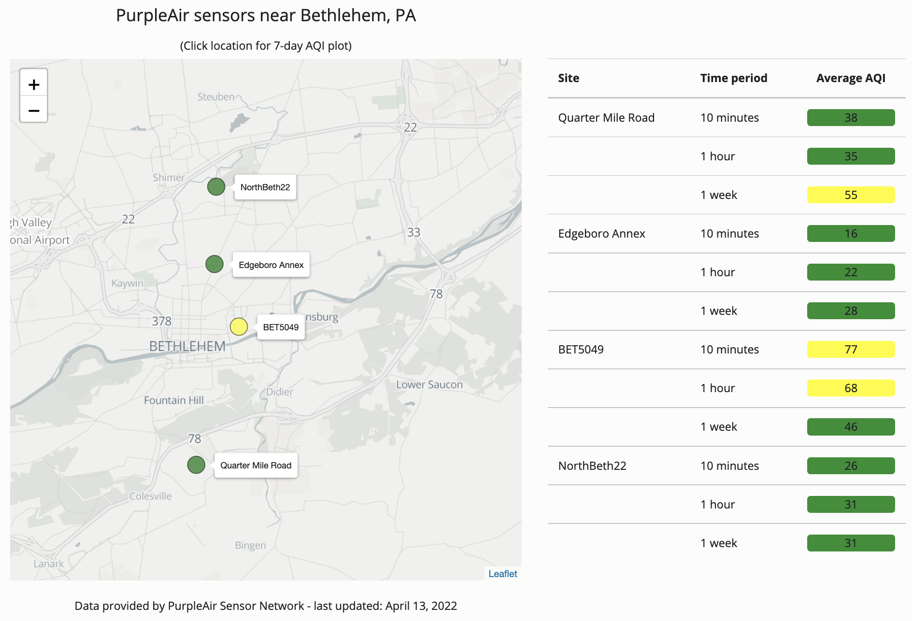</center>](https://jeremymack.shinyapps.io/purpleair/)

---
#### Topic 1: Shiny Apps - an overview
.right-column2[
<center>
]

.left-column2[
* [RStudio](<https://shiny.rstudio.com/>) product - **shiny**

* Web application framework for R

* Three basic components:

 1. a user interface object (ui)
{{content}}
]

--

 2. a server function (server)
{{content}}

--

 3. a call to the **shinyApp** function
{{content}}

---
#### Topic 1: Shiny Apps - an overview
.right-column2[
<center>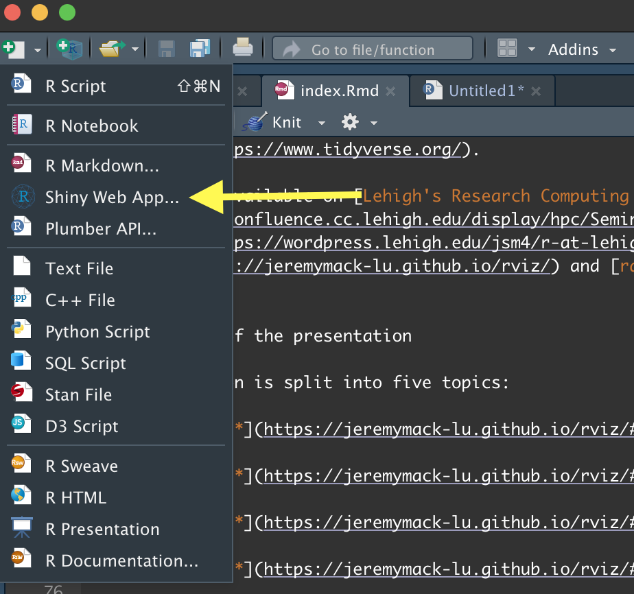
]

.left-column2[
* [RStudio](<https://shiny.rstudio.com/>) product - **shiny**

* Web application framework for R

* Ways to start creating a Shiny App:

 1. In RStudio, click the new file button and select **Shiny Web App...**

]

---
#### Topic 1: Shiny Apps - an overview
.right-column2[
<center>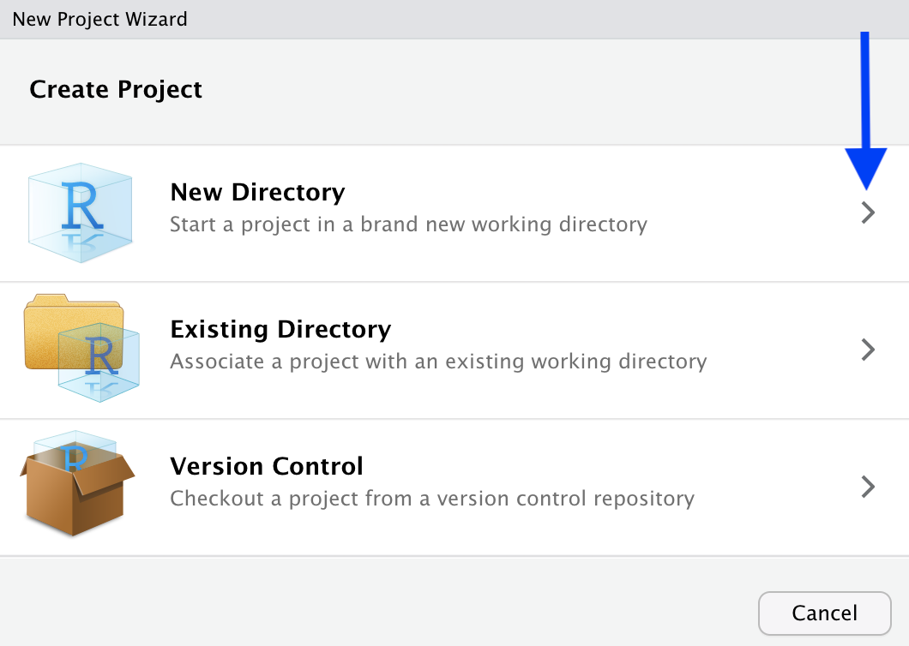
<center>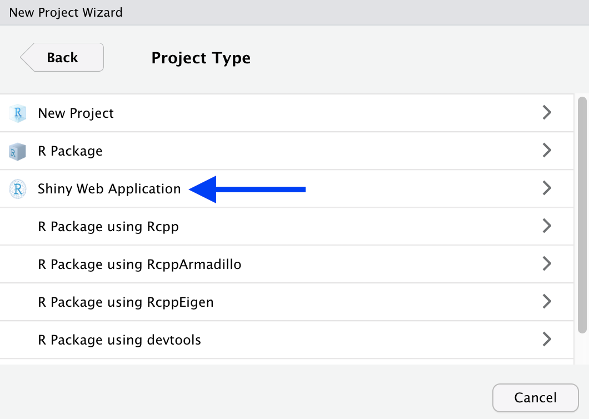
]

.left-column2[
* [RStudio](<https://shiny.rstudio.com/>) product - **shiny**

* Web application framework for R

* Ways to start creating a Shiny App:

 1. In RStudio, click the new file button and select **Shiny Web App...**

 2. In RStudio, click **File** | **New Project**, then select **New Directory** and **Shiny Web Application**

]

---
#### Topic 1: Shiny Apps - an overview
.right-column2[
<center>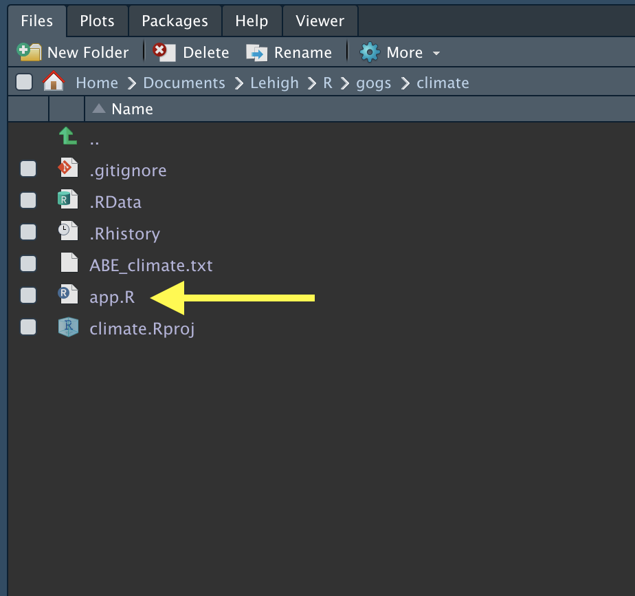
]

.left-column2[
* [RStudio](<https://shiny.rstudio.com/>) product - **shiny**

* Web application framework for R

* Ways to start creating a Shiny App:

 1. In RStudio, click the new file button and select **Shiny Web App...**
 
 2. In RStudio, click **File** | **New Project**, then select **New Directory** and **Shiny Web Application**

 3. Create a new directory and put a single file called app.R in it

]

---
#### Topic 1: Shiny Apps - an overview
.right-column2[
<center>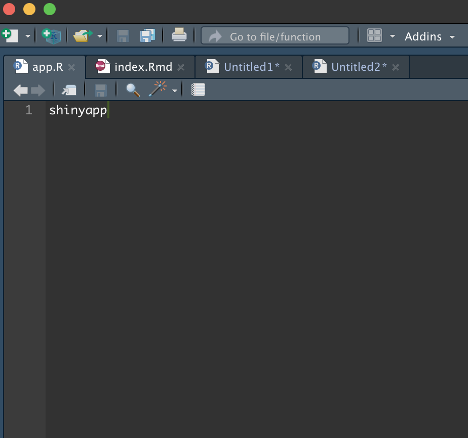
<center>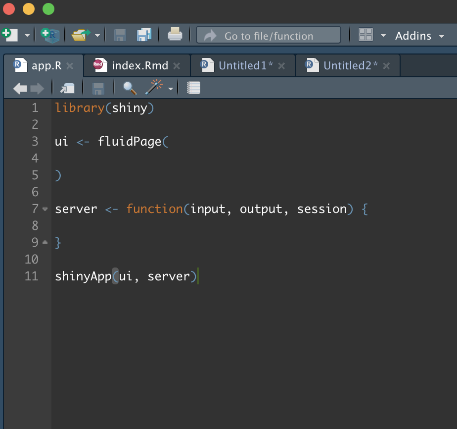
]

.left-column2[
* [RStudio](<https://shiny.rstudio.com/>) product - **shiny**

* Web application framework for R

* Ways to start creating a Shiny App:

 1. In RStudio, click the new file button and select **Shiny Web App...**
 
 2. In RStudio, click **File** | **New Project**, then select **New Directory** and **Shiny Web Application**
 
 3. Create a new directory and put a single file called app.R in it
 
 * Shortcut: You can add the app boilerplate by typing **shinyapp** and pressing Shift+Tab

]

---
class: center, middle, inverse

#### Topic 2: User Interface (ui)
<br/><br/>
<br/><br/>
<br/><br/>
<br/><br/>
<br/><br/>

---
#### Topic 2: User Interface (ui)
.right-column2[
<center>
]

.left-column2[
* Application's front end appearance

* Collection of **inputs** and **outputs**
{{content}}
]

--

* Input functions
  - Adds input controls to the ui
  
  - First argument: **inputId**
  
  - Different types of controls:
     * Free text
     * Numeric 
     * Dates 
     * Limited choices
     * File uploads
     * Action buttons

---
#### Topic 2: User Interface (ui)
.panelset[

.panel[.panel-name[Text]

.tiny[
```{r, eval=FALSE}
library(shiny)

ui <- fluidPage(
  textInput("name", "What's your name?"),
  passwordInput("password", "What's your password?"),
  textAreaInput("story", "Tell me about yourself", rows = 3)
)

server <- function(input, output, session) {}

shinyApp(ui, server)
```
]]

.panel[.panel-name[Numeric]

.tiny[
```{r, eval=FALSE}
library(shiny)

ui <- fluidPage(
  numericInput("num", "Number one", value = 0, min = 0, max = 100),
  sliderInput("num2", "Number two", value = 50, min = 0, max = 100),
  sliderInput("rng", "Range", value = c(10, 20), min = 0, max = 100)
)

server <- function(input, output, session) {}

shinyApp(ui, server)
```
]]

.panel[.panel-name[Dates]

.tiny[
```{r, eval=FALSE}
library(shiny)

ui <- fluidPage(
  dateInput("dob", "When were you born?"),
  dateRangeInput("range", "What is the range of your data?")
)

server <- function(input, output, session) {}

shinyApp(ui, server)
```
]]

.panel[.panel-name[Choices]

.tiny[
```{r, eval=FALSE}
library(shiny)

# Assign animal values
animals <- c("dog", "cat", "mouse", "bird", "other", "I don't like animals")

ui <- fluidPage(
  # Drop downs (single or multiple choices)
  selectInput("state", "What's your favorite state?", state.name),
  selectInput("state2", "What's your favourite state(s)?", state.name,
              multiple = TRUE),
  
  # Radio buttons (single choice)
  radioButtons("animal", "What's your favorite animal?", animals),
  
  # Checkbox (multiple choices)
  checkboxGroupInput("animal2", "What animals do you like?", animals)
)

server <- function(input, output, session) {}

shinyApp(ui, server)
```
]]

.panel[.panel-name[Uploads]

.tiny[
```{r, eval=FALSE}
library(shiny)

ui <- fluidPage(
  fileInput("upload", NULL)
)

server <- function(input, output, session) {}

shinyApp(ui, server)
```
]]

.panel[.panel-name[Action buttons]

.tiny[
```{r, eval=FALSE}
library(shiny)

ui <- fluidPage(
  actionButton("click", "Click me!"),
  actionButton("download", "Download")
)

server <- function(input, output, session) {}

shinyApp(ui, server)
```
]]

]

---
#### Topic 2: User Interface (ui)
.right-column2[
<center>
]

.left-column2[
* Application's front end appearance

* Collection of **inputs** and **outputs**
{{content}}
]

--

* Output functions
  - Creates placeholders later filled by the server function (render)
  
  - First argument: **outputId**
  
  - Three main types:
     * Text
     * Tables
     * Plots

---
#### Topic 2: User Interface (ui)
.panelset[

.panel[.panel-name[Text]

.tiny[
```{r, eval=FALSE}
library(shiny)

ui <- fluidPage(
  textInput("name", "What's your name?"),
  textOutput("text")
)

server <- function(input, output, session) {
  output$text <- renderText({ 
    input$name
  })
}

shinyApp(ui, server)
```
]]

.panel[.panel-name[Tables]

.tiny[
```{r, eval=FALSE}
library(shiny)

ui <- fluidPage(
  tableOutput("static"),
  dataTableOutput("dynamic")
)

server <- function(input, output, session) {
  output$static <- renderTable(head(mtcars))
  output$dynamic <- renderDataTable(mtcars, options = list(pageLength = 5))
}

shinyApp(ui, server)
```
]]

.panel[.panel-name[Plots]

.tiny[
```{r, eval=FALSE}
library(shiny)
library(ggplot2)

ui <- fluidPage(
  plotOutput("plot", width = "800px")
)

server <- function(input, output, session) {
  output$plot <- renderPlot(
    ggplot(mtcars) + geom_point(aes(mpg,hp))
  )
}

shinyApp(ui, server)
```
]]
]

---
class: inverse

#### Review - User Interface (ui):
* Application's front end appearance.

--

* Collection of **inputs** and **outputs**.

 * Inputs collect information from the user.
 
 * Outputs establish placeholders for content.

--

* Input and Output Ids are used for reference within the server function.

---
class: center, middle, inverse

#### Topic 3: Reactive Programming (server)
<br/><br/>
<br/><br/>
<br/><br/>
<br/><br/>
<br/><br/>

---
#### Topic 3: Reactive Programming (server)
.right-column2[
<center>
]

.left-column2[
* Application's back end logic

* **Server** function
{{content}}
]

--

* Creates (renders) outputs based on inputs from the browser

---
#### Topic 3: Reactive Programming (server)
.right-column2[
<center>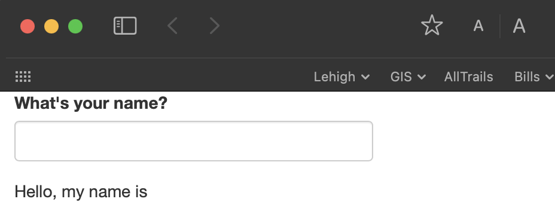
<center>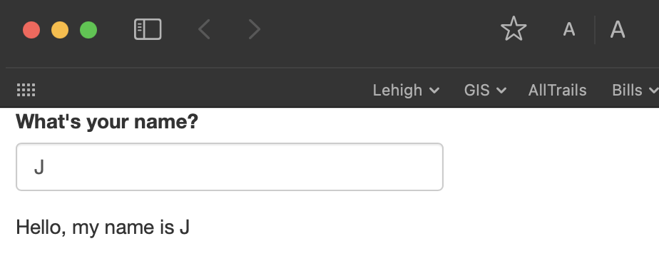
<center>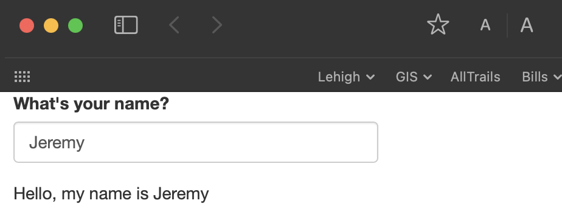
<center>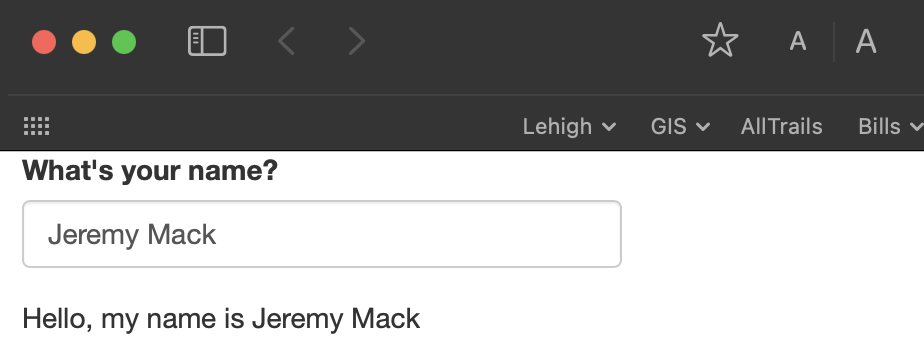
]

.tiny2.left-column2[
* Application's back end logic

* **Server** function

* Creates (renders) outputs based on inputs from the browser

```{r, eval=FALSE}
ui <- fluidPage(
  textInput("name", "What's your name?"),
  textOutput("text")
)

server <- function(input, output, session) {
  output$text <- renderText(
    paste("Hello, my name is ", input$name))
}

shinyApp(ui, server)
```
]

---
#### Topic 3: Reactive Programming (server)
.right-column2[
<center>
]

.left-column2[
* Application's back end logic

* **Server** function

* Creates (renders) outputs based on inputs from the browser

* Render functions should match output functions
{{content}}
]

--
 - renderText
 - renderPlot
 - renderTable, or renderDataTable

---
#### Topic 3: Reactive Programming (server)
.right-column2[
<center>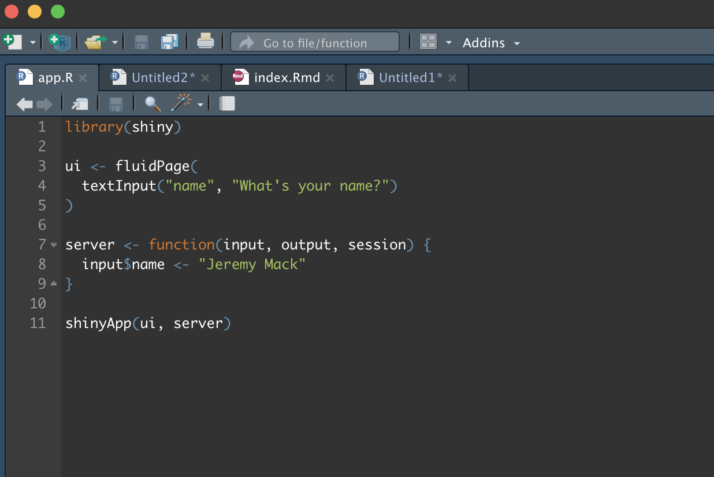
<center>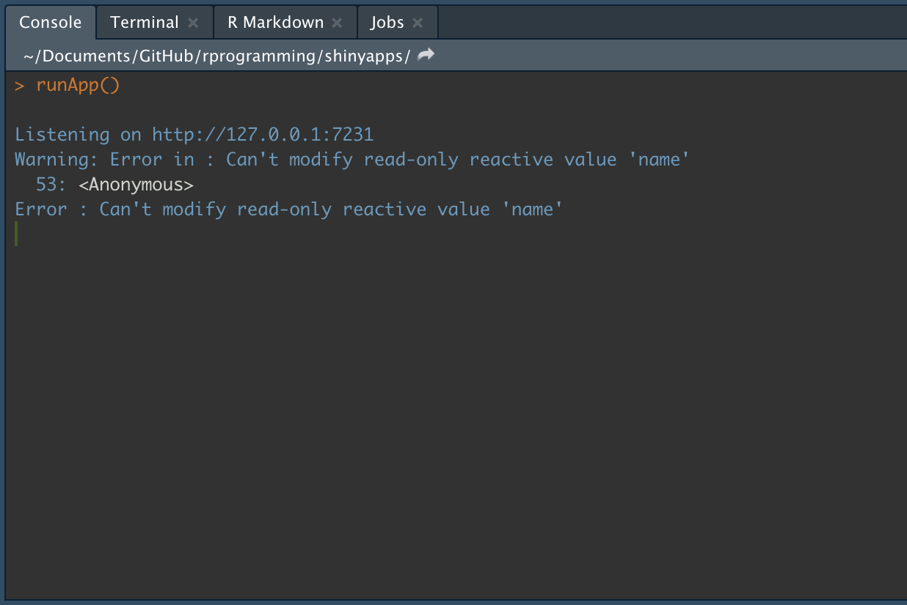
]

.left-column2[
* Application's back end logic

* **Server** function

* Creates (renders) outputs based on inputs from the browser

* Render functions should match output functions

* Some things to remember:
 * **input** objects are read-only
]

---
#### Topic 3: Reactive Programming (server)
.right-column2[
<center>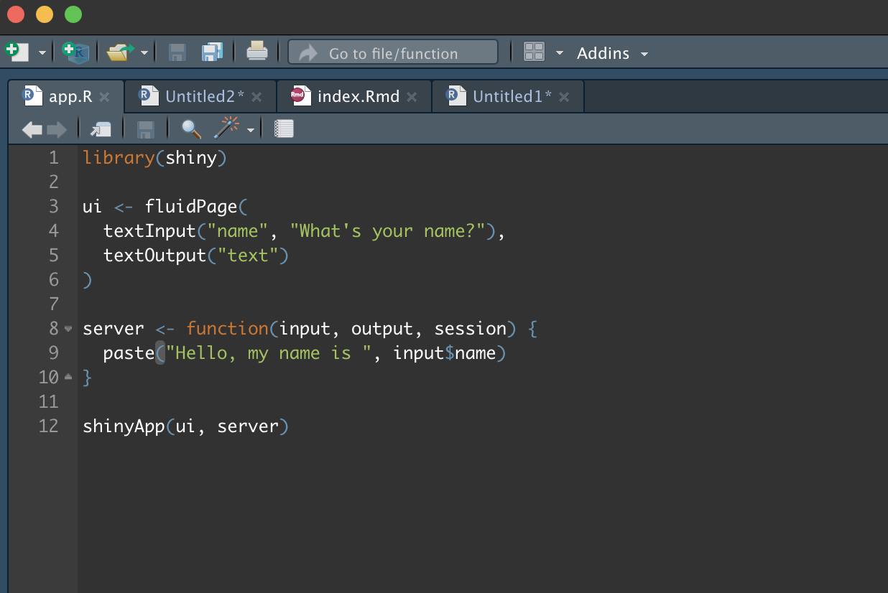
<center>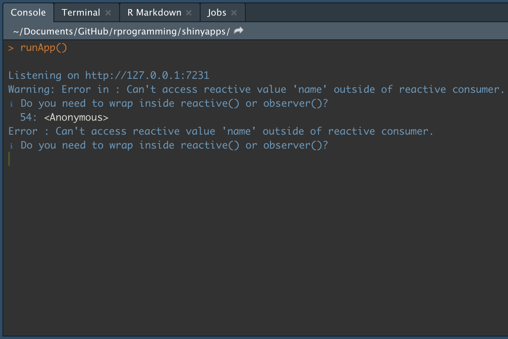
]

.left-column2[
* Application's back end logic

* **Server** function

* Creates (renders) outputs based on inputs from the browser

* Render functions should match output functions

* Some things to remember:
 * **input** objects are read-only
 
 * **input** and **output** objects are read in reactive context created by a function like renderText() or reactive()
]

---
#### Topic 3: Reactive Programming (server)
.right-column2[
<center>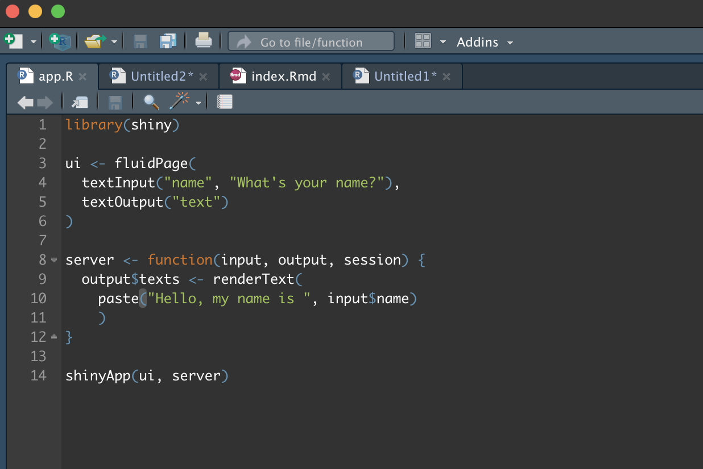
<center>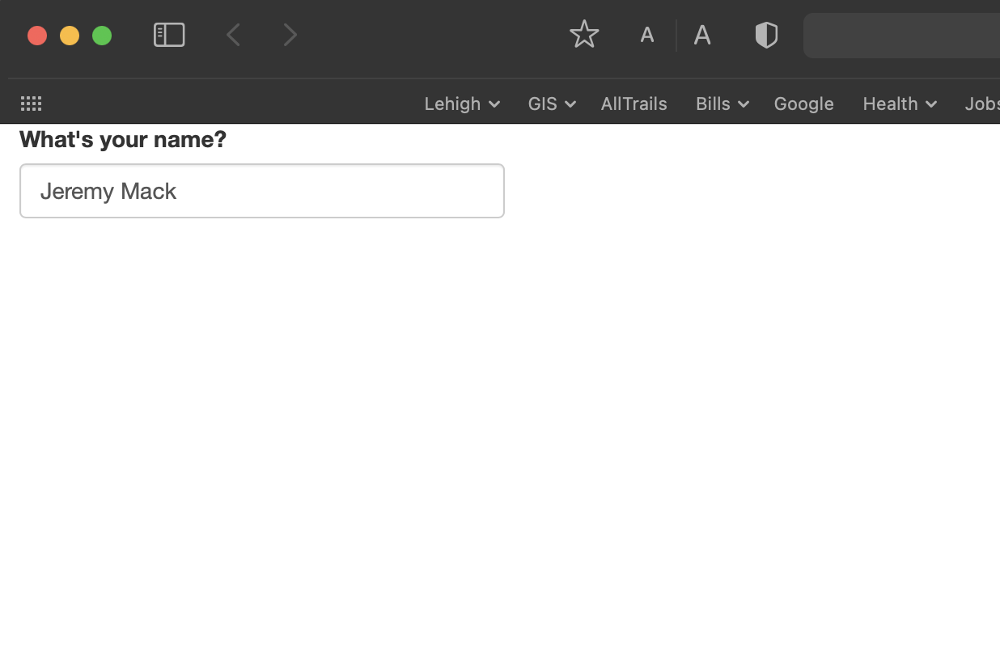
]

.left-column2[
* Application's back end logic

* **Server** function

* Creates (renders) outputs based on inputs from the browser

* Render functions should match output functions

* Some things to remember:
 * **input** objects are read-only
 
 * **input** and **output** objects are read in reactive context created by a function like renderText() or reactive()
 
 * Check your spelling!
]

---
#### Topic 3: Reactive Programming (server)
.right-column2[
<center>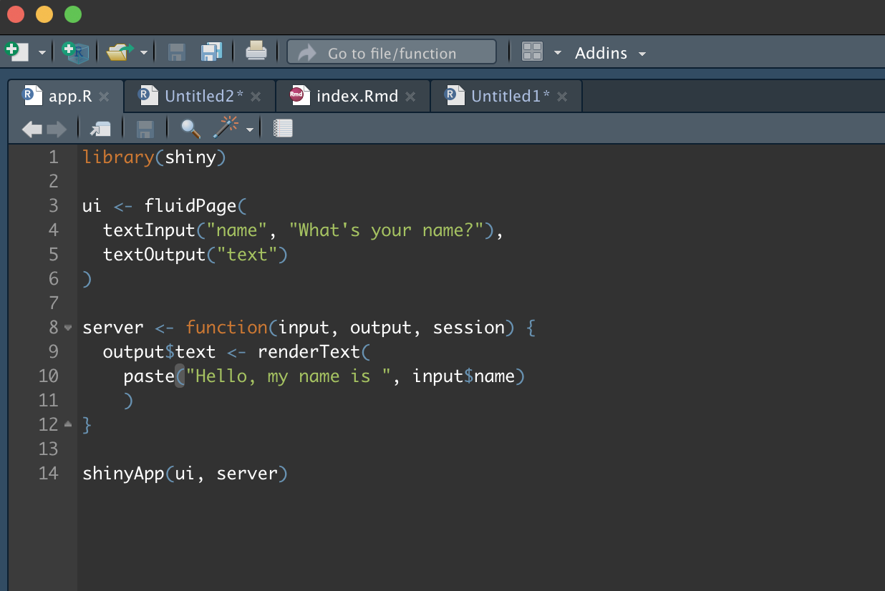
<center>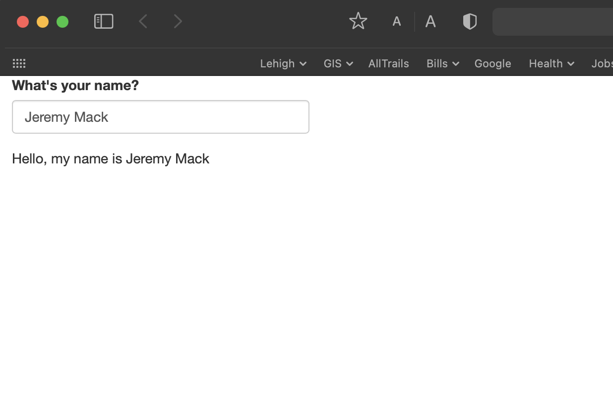
]

.left-column2[
* Application's back end logic

* **Server** function

* Creates (renders) outputs based on inputs from the browser

* Render functions should match output functions

* Some things to remember:
 * **input** objects are read-only
 
 * **input** and **output** objects are read in reactive context created by a function like renderText() or reactive()
 
 * Check your spelling!
]

---
class: inverse

#### Review - Server:
* Application's back end logic.

--

* Reacts to inputs from the ui and **produces outputs** to fill in ui placeholders.

 * Cannot assign inputs in the server function ("read-only").
 
 * **input** and **output** objects are read in reactive context.
 
 * Render functions should match output functions

---
class: center, middle, inverse

#### Topic 4: Layouts and Themes
<br/><br/>
<br/><br/>
<br/><br/>
<br/><br/>
<br/><br/>

---
#### Topic 4: Layouts and Themes
.right-column2[
<center>
]

.left-column2[
* Layouts add structure to an application

* Created by a hierarchy of function calls
]

---
#### Topic 4: Layouts and Themes
.right-column2[
<center>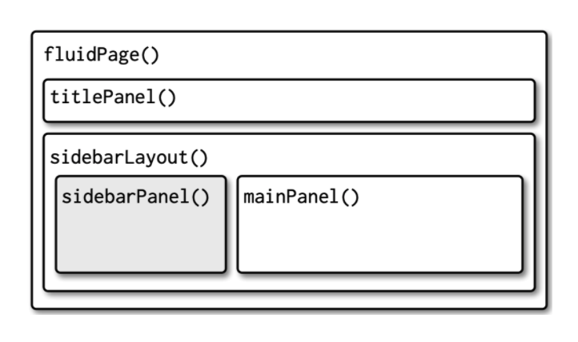
]

.tiny2.left-column2[
* Layouts add structure to an application

* Created by a hierarchy of function calls

* sidebarLayout:

```{r, eval=FALSE}
ui <- fluidPage(

)
```
]

---
#### Topic 4: Layouts and Themes
.right-column2[
<center>
]

.tiny2.left-column2[
* Layouts add structure to an application

* Created by a hierarchy of function calls

* sidebarLayout:

```{r, eval=FALSE}
ui <- fluidPage(
  titlePanel(),
  sidebarLayout(
    sidebarPanel(),
    mainPanel()
  )
)
```
]

---
#### Topic 4: Layouts and Themes
.right-column2[
<center>
]

.tiny2.left-column2[
* Layouts add structure to an application

* Created by a hierarchy of function calls

* sidebarLayout:

```{r, eval=FALSE}
ui <- fluidPage(
  titlePanel("My first Shiny App"),
  sidebarLayout(
    sidebarPanel(
      width=2,
      textInput("name", "What's your name?")),
    mainPanel(textOutput("text"))
  )
)
```
]

---
#### Topic 4: Layouts and Themes
.right-column2[
<center>
]

.tiny2.left-column2[
* Layouts add structure to an application

* Created by a hierarchy of function calls

* sidebarLayout:

```{r, eval=FALSE}
ui <- fluidPage(
  titlePanel("My first Shiny App"),
  sidebarLayout(
    sidebarPanel(
      width=2,
      textInput("name", "What's your name?")),
    mainPanel(textOutput("text"))
  )
)

server <- function(input, output, session) {
  output$text <- renderText({
    if (input$name=="")
      return(NULL)
    else paste("Hello, my name is ", input$name) 
    })
}

shinyApp(ui, server)
```
]

---
#### Topic 4: Layouts and Themes
.right-column2[
<center>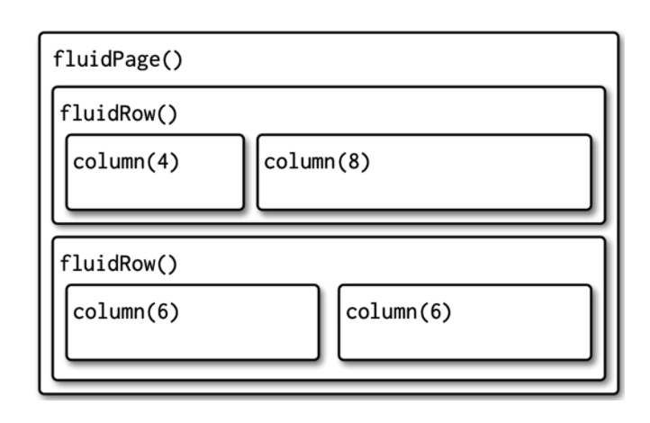
]

.tiny2.left-column2[
* Layouts add structure to an application

* Created by a hierarchy of function calls

* fluidRows with columns:

```{r, eval=FALSE}
ui <- fluidPage(
  fluidRow(
    column(4, textInput("name", "What's your name?")),
    column(8, textOutput("text"))),
  fluidRow(
    column(6, dataTableOutput("dynamic")),
    column(6, plotOutput("plot"))))

server <- function(input, output, session) {
  output$text <- renderText({
    if (input$name=="")
      return(NULL)
    else paste("Hello, my name is ", input$name) 
    })
  
  output$dynamic <- renderDataTable(mtcars)
  
  output$plot <- renderPlot(
    ggplot(mtcars, aes(hp,mpg)) + geom_point())}

shinyApp(ui, server)
```
]

---
#### Topic 4: Layouts and Themes
.right-column2[
<center>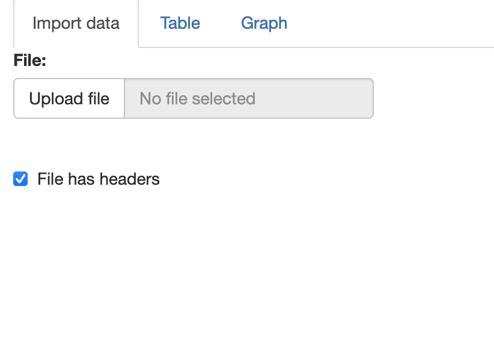
]

.tiny2.left-column2[
* Layouts add structure to an application

* Created by a hierarchy of function calls

* Tabsets:

```{r, eval=FALSE}
ui <- fixedPage(
  tabsetPanel(
    tabPanel("Import data", 
      fileInput("file", "File:", buttonLabel="Upload file"),
      checkboxInput("header", "File has headers", TRUE)),
    tabPanel("Table", dataTableOutput("table")),
    tabPanel("Graph", plotOutput("plot"))))

server <- function(input, output, session) {
  df <- reactive({
    file <- input$file
    read.csv(file$datapath, header=input$header)
  })
  
  output$table <- renderDataTable(df())
  
  output$plot <- renderPlot(
    ggplot(df(), aes(hp,mpg)) + geom_point())}

shinyApp(ui, server)
```
]

---
#### Topic 4: Layouts and Themes
.right-column2[
<center>
]

.left-column2[
* Themes change the overall appearance

* Shiny uses a [Bootstrap](https://getbootstrap.com/) framework

* Customizations made using **bslib**
]

---
#### Topic 4: Layouts and Themes
.right-column2[
<center>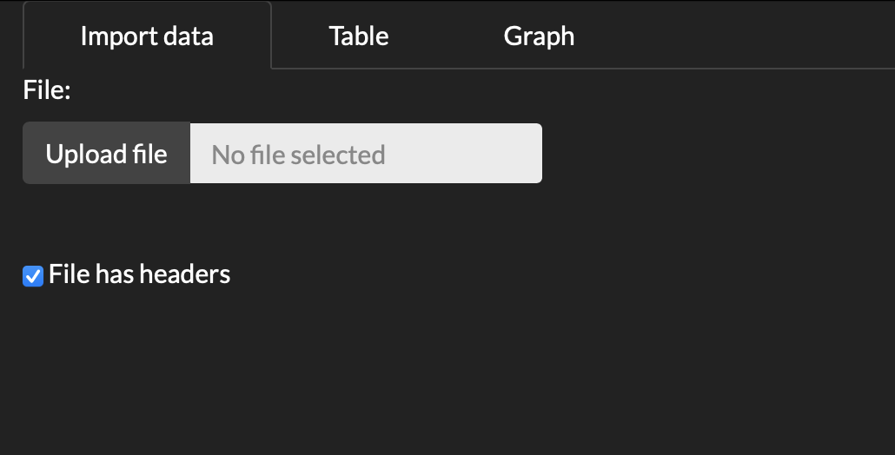
]

.tiny2.left-column2[
* Themes change the overall appearance

* Shiny uses a [Bootstrap](https://getbootstrap.com/) framework

* Customizations made using **bslib**

```{r, eval=FALSE}
ui <- fixedPage(
  theme=bslib::bs_theme(bootswatch = "darkly"),
  tabsetPanel(
    tabPanel("Import data", 
      fileInput("file", "File:", buttonLabel="Upload file"),
      checkboxInput("header", "File has headers", TRUE)),
    tabPanel("Table", dataTableOutput("table")),
    tabPanel("Graph", plotOutput("plot"))))

server <- function(input, output, session) {
  df <- reactive({
    file <- input$file
    read.csv(file$datapath, header=input$header)
  })
  
  output$table <- renderDataTable(df())
  
  output$plot <- renderPlot(
    ggplot(df(), aes(hp,mpg)) + geom_point())}

shinyApp(ui, server)
```
]

---
#### Topic 4: Layouts and Themes
.right-column2[
<center>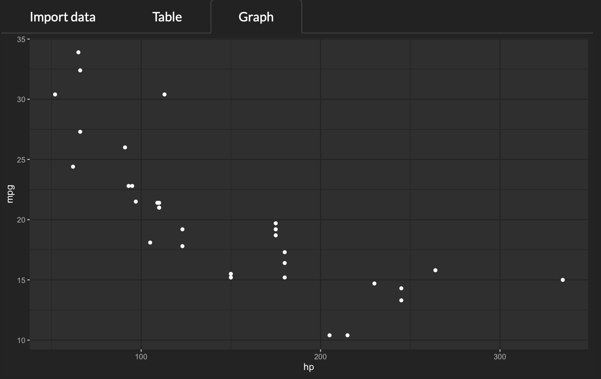
]

.tiny2.left-column2[
* Themes change the overall appearance

* Shiny uses a [Bootstrap](https://getbootstrap.com/) framework

* plot themes can be matched with **thematic**

```{r, eval=FALSE}
server <- function(input, output, session) {
  thematic::thematic_shiny()
  
  df <- reactive({
    file <- input$file
    read.csv(file$datapath, header=input$header)
  })
  
  output$table <- renderDataTable(df())
  
  output$plot <- renderPlot(
    ggplot(df(), aes(hp,mpg)) + geom_point())}

shinyApp(ui, server)
```
]

---
#### Topic 4: Layouts and Themes
.tiny2.left-column2[
* Themes change the overall appearance

* Shiny uses a [Bootstrap](https://getbootstrap.com/) framework

* Custom HTML and CSS can be applied
]

[<center>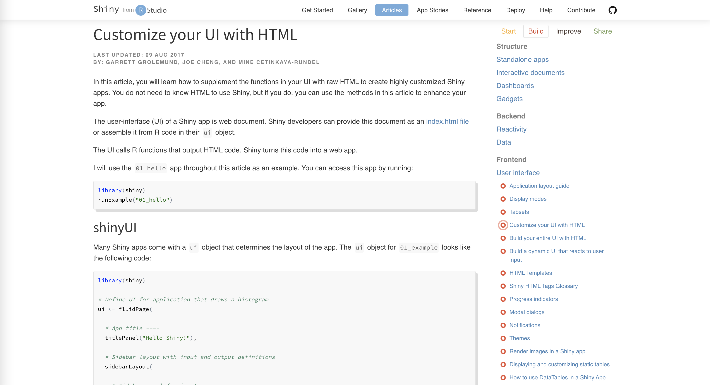</center>](https://shiny.rstudio.com/articles/html-tags.html)

---
#### Topic 4: Layouts and Themes
.tiny2.left-column2[
* Layouts add structure to an application

* Themes change the overall appearance

* Extension packages exist that combine the two
  
  * RStudio - **shinydashboard**
  
  * [Awesome Shiny Extensions](https://github.com/nanxstats/awesome-shiny-extensions)
]

.right-column2[
<center>
]

---
class: center, middle, inverse

#### Topic 5: Example - Lehigh Valley Temperature
<br/><br/>
<br/><br/>
<br/><br/>
<br/><br/>
<br/><br/>

---
#### Topic 5: Example - Lehigh Valley Temperature

<center>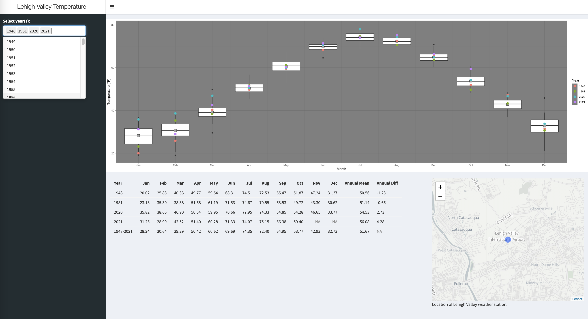</center>

---
#### Topic 5: Example - required packages
.tiny2.left-column8[
```{r, eval=FALSE}
# Load packages ----
library(shiny)           # Web application framework
library(shinydashboard)  # Dashboard templates for Shiny
library(readr)           # Read in rectangular text files
library(dplyr)           # Data manipulation
library(tidyr)           # Data cleanup
library(ggplot2)         # Grammar of graphics data viz
library(lubridate)       # Working with dates
library(leaflet)         # JS leaflet library
```
]

--

.tiny2.left-column8[
* Note that bulk loading techniques will not work when deployed
```{r, eval=FALSE}
# Load packages ----
library(pacman)
pload(shiny,shinydashboard,readr,dplyr,tidyr,ggplot2,lubridate,leaflet)
```
]

---
#### Topic 5: Example - data & data cleanup
.tiny2.left-column8[
```{r, eval=FALSE}
# Load climate data ----
# Read in climate data
url <- "https://raw.githubusercontent.com/jeremymack-LU/shinyapps/master/data/abe_climate.csv"
df <- read_csv(url, col_types=cols(tavg=col_double()))

# Fix extreme outlier
df[df$date==as.Date("1954-05-20"),6] <- NA

# Calculate daily mean temperature (dmt) and day of year (doy)
df <- df %>%
  # Convert from units of tenths
  mutate(prcp=prcp/10,
         tmax=tmax/10,
         tmin=tmin/10,
         tavg=tavg/10) %>%
  # Convert to from degrees C to degrees F
  mutate(dmt=(tmax+tmin)/2,
         doy=yday(date),
         tmin=tmin * 1.8 + 32,
         tmax=tmax * 1.8 + 32,
         dmt=dmt * 1.8 + 32,
         year=year(date))
```
]

---
#### Topic 5: Example - data summary
.tiny2.left-column6[
```{r, eval=FALSE}
# Summarize temperature data ----
# Calculate monthly means by year
monthly.means <- df %>%
  group_by(month(date), year(date)) %>%
  summarize(avg=mean(dmt, na.rm=TRUE)) %>%
  rename(month=`month(date)`,
         year=`year(date)`)

# Calculate the overall means by month
monthly.sum <- df %>%
  group_by(month(date)) %>%
  summarize(avg=mean(dmt, na.rm=TRUE)) %>%
  rename(month=`month(date)`)

# Long to wide format
monthly.sum.W <- monthly.sum %>%
  mutate(Year='1948-2021',label=month.abb[month]) %>% 
  pivot_wider(id_cols=Year,names_from=label,values_from=avg) %>% 
  mutate(Annual_mean=rowMeans(.[,2:13], na.rm=TRUE),
         Annual_diff=0)
```
]

.tiny2.right-column6[
```{r, include=FALSE}
# Load packages ----
pacman::p_load(tidyverse,rnoaa,lubridate,shiny,shinydashboard,leaflet)

# Load climate data ----
# Read in climate data
url <- "https://raw.githubusercontent.com/jeremymack-LU/shinyapps/master/data/abe_climate.csv"
df <- read_csv(url, col_types=cols(tavg=col_double()))

# Fix extreme outlier
df[df$date==as.Date("1954-05-20"),6] <- NA

# Calculate daily mean temperature (dmt) and day of year (doy)
df <- df %>%
  # Convert from units of tenths
  mutate(prcp=prcp/10,
         tmax=tmax/10,
         tmin=tmin/10,
         tavg=tavg/10) %>%
  # Convert to from degrees C to degrees F
  mutate(dmt=(tmax+tmin)/2,
         doy=yday(date),
         tmin=tmin * 1.8 + 32,
         tmax=tmax * 1.8 + 32,
         dmt=dmt * 1.8 + 32,
         year=year(date))

# Summarize temperature data ----
# Calculate monthly means by year
monthly.means <- df %>%
  group_by(month(date), year(date)) %>%
  summarize(avg=mean(dmt, na.rm=TRUE)) %>%
  rename(month=`month(date)`,
         year=`year(date)`)

# Calculate the overall means by month
monthly.sum <- df %>%
  group_by(month(date)) %>%
  summarize(avg=mean(dmt, na.rm=TRUE)) %>%
  rename(month=`month(date)`)

# Long to wide format
monthly.sum.W <- monthly.sum %>%
  mutate(Year='1948-2021',label=month.abb[month]) %>% 
  pivot_wider(id_cols=Year,names_from=label,values_from=avg) %>% 
  mutate(Annual_mean=rowMeans(.[,2:13], na.rm=TRUE),
         Annual_diff=0)
```

```{r}
head(monthly.means)
head(monthly.sum)
```
]

---
#### Topic 5: Example - create Shiny App
.tiny2.left-column8[
```{r, eval=FALSE}
# Assign labels and map settings
labels <- c("Jan","Feb","Mar","Apr","May","Jun","Jul","Aug","Sep","Oct","Nov","Dec")
map    <- tibble(lat=40.65, lng=-75.442, zoom=13)

# Create the Shiny App ----
# User Interface (ui)
ui <- dashboardPage(skin="black",
                    dashboardHeader(
                      title="Lehigh Valley Temperature", titleWidth=300),
                    dashboardSidebar(
                      width=300,
                      selectInput(
                        inputId="years",
                        label="Select year(s):",
                        choices=seq(1948,2022,1),
                        multiple=TRUE,
                        selected=2022)),
                    dashboardBody(
                      fluidRow(column(12,plotOutput("plot", height='500px'))),
                      br(),
                      fluidRow(column(8,tableOutput("data")),
                               column(4,leafletOutput("map"),
                                      fluidRow(column(12, 'Location of Lehigh Valley weather station.'))))
  )
)
```
]

---
#### Topic 5: Example - create Shiny App
.tiny3.left-column8[
```{r, eval=FALSE}
# Server function (server)
server <- function(input, output, session) {
  df.sub <- reactive(monthly.means %>% filter(year %in% input$years))
  output$plot <- renderPlot(ggplot() +
                              geom_boxplot(aes(month,avg,group=month), monthly.means) +
                              geom_point(aes(month,avg), monthly.sum,size=4,fill='darkgray',shape=22) +
                              geom_point(aes(month,avg,color=factor(year)),df.sub(),size=3) +
                              scale_x_continuous(breaks=seq(1,12,1),labels=labels,expand=c(0.02,0)) +
                              labs(x="Month",y="Temperature (°F)",color="Year") + theme_dark())
```
]
---
#### Topic 5: Example - create Shiny App
.tiny3.left-column8[
```{r, eval=FALSE}
# Server function (server)
server <- function(input, output, session) {
  df.sub <- reactive(monthly.means %>% filter(year %in% input$years))
  output$plot <- renderPlot(ggplot() +
                              geom_boxplot(aes(month,avg,group=month), monthly.means) +
                              geom_point(aes(month,avg), monthly.sum,size=4,fill='darkgray',shape=22) +
                              geom_point(aes(month,avg,color=factor(year)),df.sub(),size=3) +
                              scale_x_continuous(breaks=seq(1,12,1),labels=labels,expand=c(0.02,0)) +
                              labs(x="Month",y="Temperature (°F)",color="Year") + theme_dark())
  output$data <- renderTable({
    if(is.null(input$years)) monthly.sum.W %>% rename('Annual Mean'=Annual_mean, 'Annual Diff'=Annual_diff)
    else df.sub() %>%
      mutate(month=as.integer(month),label=month.abb[month],Year=as.integer(year)) %>%
      pivot_wider(id_cols=Year,names_from=label,values_from=avg) %>%
      mutate(Annual_mean=rowMeans(.[,-1], na.rm=TRUE)) %>%
      mutate(Annual_diff=Annual_mean-mean(df$dmt, na.rm=TRUE)) %>%
      mutate(Year=as.character(Year)) %>%
      bind_rows(monthly.sum.W) %>%
      rename('Annual Mean'=Annual_mean, 'Annual Diff'=Annual_diff)}, digits=1)
```
]

---
#### Topic 5: Example - create Shiny App
.tiny3.left-column8[
```{r, eval=FALSE}
# Server function (server)
server <- function(input, output, session) {
  df.sub <- reactive(monthly.means %>% filter(year %in% input$years))
  output$plot <- renderPlot(ggplot() +
                              geom_boxplot(aes(month,avg,group=month), monthly.means) +
                              geom_point(aes(month,avg), monthly.sum,size=4,fill='darkgray',shape=22) +
                              geom_point(aes(month,avg,color=factor(year)),df.sub(),size=3) +
                              scale_x_continuous(breaks=seq(1,12,1),labels=labels,expand=c(0.02,0)) +
                              labs(x="Month",y="Temperature (°F)",color="Year") + theme_dark())
  output$data <- renderTable({
    if(is.null(input$years)) monthly.sum.W %>% rename('Annual Mean'=Annual_mean, 'Annual Diff'=Annual_diff)
    else df.sub() %>%
      mutate(month=as.integer(month),label=month.abb[month],Year=as.integer(year)) %>%
      pivot_wider(id_cols=Year,names_from=label,values_from=avg) %>%
      mutate(Annual_mean=rowMeans(.[,-1], na.rm=TRUE)) %>%
      mutate(Annual_diff=Annual_mean-mean(df$dmt, na.rm=TRUE)) %>%
      mutate(Year=as.character(Year)) %>%
      bind_rows(monthly.sum.W) %>%
      rename('Annual Mean'=Annual_mean, 'Annual Diff'=Annual_diff)}, digits=1)
  output$map <- renderLeaflet(
    leaflet() %>%
      setView(lat=map$lat, lng=map$lng, zoom=map$zoom) %>%
      addTiles("https://tiles.stadiamaps.com/tiles/alidade_smooth/{z}/{x}/{y}{r}.png") %>%
      addCircleMarkers(lng=map$lng, lat=map$lat,
        popup='Lehigh Valley International Airport<br>NOAA Weather Station', stroke=FALSE, fillOpacity=0.5))}
```
]

---
#### Topic 5: Example - run Shiny App
.tiny3.left-column8[
```{r, eval=FALSE}
# Run the app
shinyApp(ui, server)
```
]

<center></center>

---
class: center, middle, inverse

#### Topic 6: Deploying Shiny Apps
<br/><br/>
<br/><br/>
<br/><br/>
<br/><br/>
<br/><br/>

---
#### Topic 6: Deploying Shiny Apps
.right-column2[
<center>
]

.tiny3.left-column2[
* Two methods for deployment:
  - [Run locally](https://shiny.rstudio.com/articles/deployment-local.html)
 
     * Gist, GitHub repository, .zip,<br>R package
     
     * Gist example:
    ```{r, eval=FALSE}
     shiny::runGist('72d6b068a3377972f385f053c2d87388')
    ```
]

---
#### Topic 6: Deploying Shiny Apps
.right-column2[
<center>
]

.tiny3.left-column2[
* Two methods for deployment:
  - [Run locally](https://shiny.rstudio.com/articles/deployment-local.html)
 
     * Gist, GitHub repository, .zip,<br>R package
     
     * Gist example:
    ```{r, eval=FALSE}
     shiny::runGist('72d6b068a3377972f385f053c2d87388')
    ```
     
  - [Web-based](https://shiny.rstudio.com/articles/deployment-web.html)
     
     * Shiny server, shinyapps.io, RStudio Connect
]

---
class: center, middle, inverse

#### Topic 7: Resources
<br/><br/>
<br/><br/>
<br/><br/>
<br/><br/>
<br/><br/>

---
#### Topic 7: Resources

* Shiny Apps

 * *Mastering Shiny* by Hadley Wickham - [link](https://mastering-shiny.org)
 
 * RStudio tutortials - [link](https://shiny.rstudio.com/tutorial/)
 
 * Shiny extensions - [link](https://github.com/nanxstats/awesome-shiny-extensions)

.pull-right[
<center>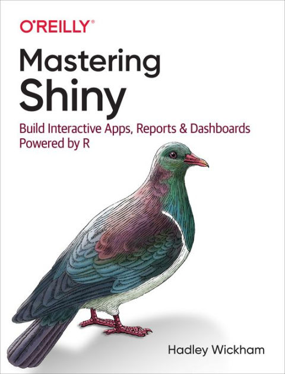</center>
]
 
---
class: center, middle, inverse, title-slide

## Questions?
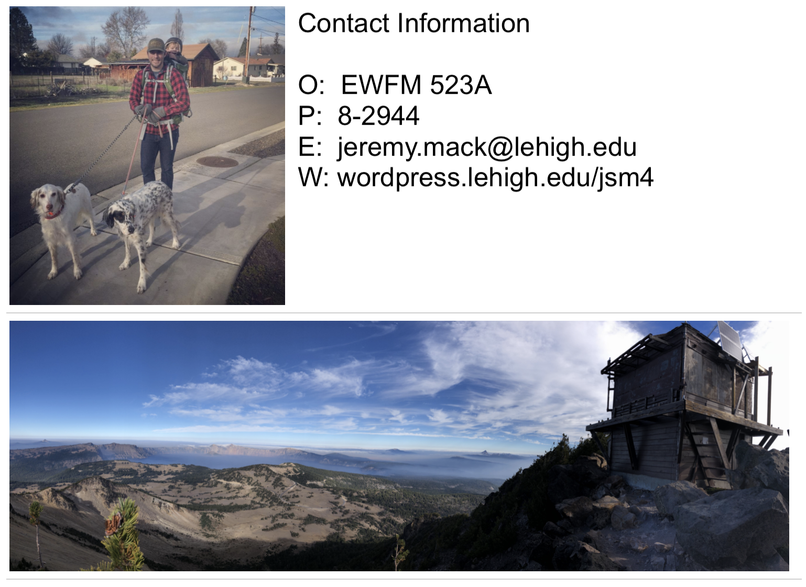